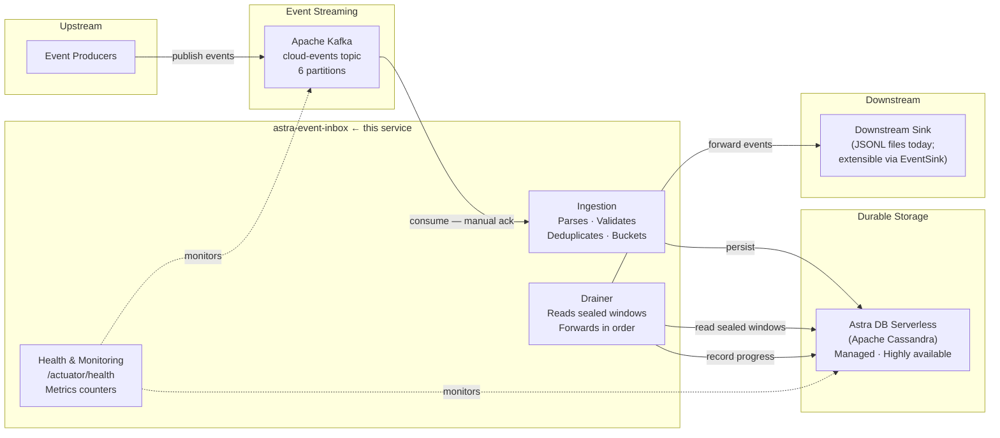

# Event Inbox Pattern using Astra DB and Kafka

> **Status:** Proof of Concept — functional and validated.
> Core ingestion, deduplication, windowing, and drain-progress patterns are implemented and working.
> Intended for evaluation, experimentation, and learning — not yet production-hardened.
> See [Known Limitations](#known-limitations) and [Roadmap](#roadmap) before scoping a production implementation.

**Stack:** Spring Boot 3.3 · Java 21 · Apache Kafka (KRaft) · DataStax Astra DB Serverless

---

## At a Glance

```
Event Producers
      ↓ CloudEvents 1.0 over Kafka
Apache Kafka  (at-least-once delivery)
      ↓ manual offset commitment
Event Inbox  (this service)
      ↓ persist before ack
Astra DB  (idempotent upsert · time-windowed storage)
      ↓ sealed window drain
Downstream Consumer  (ordered · deduplicated · replayable)
```

- **Durable ingestion** — every event written to Astra DB before the Kafka offset advances
- **Idempotent deduplication** — Cassandra composite primary key absorbs Kafka redeliveries with no extra logic
- **Ordered windowed delivery** — events grouped into 5-second time windows and drained in event-time order
- **Replay capability** — drain progress persisted in Astra DB; restart resumes from last known position
- **Dead-letter handling** — unparseable messages routed to a DLT; partitions never stall

---

## Why This Pattern Matters

A high-throughput Kafka stream has properties that make it difficult to consume reliably
without infrastructure support: events arrive faster than a downstream can process them,
Kafka may redeliver messages after a failure, and ordering within a time window is often
required by the business logic.

The **Event Inbox pattern** solves this at the infrastructure layer so application code
does not have to. The inbox acts as a durable, ordered buffer between the stream and any
downstream processing system.

The pattern is broadly applicable. Common architectural scenarios:

- **Event-driven microservices** — reliable Kafka consumption without custom deduplication
- **Customer profile or account updates** — ordered, idempotent application of state changes
- **Order and provisioning workflows** — guaranteed delivery with replay capability
- **IoT event ingestion** — high-throughput time-series buffering before downstream analytics
- **CDC pipelines** — capture change events durably and replay to new consumers
- **Audit logging** — every event persisted with timestamp before acknowledgement
- **Downstream outage buffering** — absorb events while the downstream recovers
- **Integration hubs** — normalize and buffer events from multiple upstream producers

**Why Cassandra (Astra DB) fits this pattern well:** The partition-per-window data model maps
directly to Cassandra's design strengths — append-only writes, ordered reads by clustering key,
idempotent upsert, and automatic TTL expiry. No transactions, no locks, no read-before-write.

---

## Architecture



### End-to-End Flow

1. An **event producer** publishes a CloudEvent 1.0 JSON message to the `cloud-events` Kafka topic.
2. The **inbox consumer** polls the topic (6 threads, one per partition) with offset commitment disabled until processing is confirmed.
3. Each message is **parsed and validated**. Unparseable messages are routed to `cloud-events.DLT` before the offset advances — the partition never stalls.
4. A **deterministic time-window bucket** is computed from `event_ts`: `floor(epoch_s(event_ts) / W) * W`. The same event always lands in the same bucket regardless of when it arrives.
5. The event is **written to Astra DB** via an idempotent CQL upsert at `LOCAL_QUORUM`. Redeliveries of the same event overwrite the same row.
6. The **Kafka offset is committed only after the write succeeds**. If the write fails, Kafka redelivers and the upsert absorbs it safely. No event is ever silently dropped.
7. The **drainer** runs on a schedule. When `now ≥ window_bucket + W + allowed_lateness`, the window is sealed — the drainer reads the complete partition in event-time order and forwards it to the downstream sink.
8. The **downstream sink** writes a JSONL file with an atomic rename. The `EventSink` interface is the extension point for production targets (Kafka, REST, cloud storage).
9. **Drain progress** is persisted in Astra DB. On restart, the drainer resumes from the last completed window — no re-draining, no data loss.

For full component diagrams, sequence diagrams, and async write path detail, see [`docs/architecture-engineering.md`](docs/architecture-engineering.md).

---

## Why Astra DB

The architectural choice is **Apache Cassandra**. Astra DB Serverless is how you run
Cassandra without operating a cluster.

The inbox write pattern is a natural Cassandra fit:

- **Time-series, append-only writes.** Each time window is one Cassandra partition. Events are written sequentially by `event_ts` — no random access, no updates.
- **Idempotent upsert at the storage layer.** `PRIMARY KEY ((window_bucket), event_ts, event_id)` makes every CQL INSERT an upsert. Redelivering the same event produces the same row — no read-before-write, no deduplication table.
- **Ordered reads for free.** `CLUSTERING ORDER BY (event_ts ASC)` means a sealed-window `SELECT WHERE window_bucket = ?` returns events in event-time order without a sort step.
- **No infrastructure to operate.** Astra DB manages replication, compaction, and availability. The application writes CQL; the cluster is fully managed.

| | Self-managed Cassandra | Astra DB Serverless |
|---|---|---|
| Infrastructure | Cluster sizing, replication, TWCS, gc_grace | None — fully managed |
| Scaling | Manual capacity planning | Serverless auto-scaling |
| Time-series fit | ✅ Natural | ✅ Same internals |
| Idempotent upsert | ✅ Native | ✅ Native |
| CQL compatibility | Full | Full |

---

## Why Kafka

Three Kafka properties are leveraged by design:

| Property | How it is used |
|---|---|
| **At-least-once delivery** | Offset advances only after a confirmed Astra DB write. Redeliveries are absorbed by the idempotent upsert. No event is ever silently dropped. |
| **Dead-letter routing** | Unparseable messages go to `cloud-events.DLT` before the offset commits. The partition never stalls on a poison message. |
| **Partition parallelism** | Six partitions, six consumer threads. Event-time ordering across partitions is resolved by the time-window model. |

---

## 🚀 Quick Start

Get a running instance in under 5 minutes.

### 1. Create an Astra DB database

1. Sign up or log in at [astra.datastax.com](https://astra.datastax.com) (free tier works).
2. Create a **Serverless** database — any name, any cloud region.
3. Create a keyspace named `tds_inbox`.
4. Go to **Connect → Drivers** and download the **Secure Connect Bundle** (`.zip`).
5. Under **Database Access**, create a **Service Account** and note the Client ID and Client Secret.

### 2. Configure the environment

```bash
git clone <repo-url>
cd astra-event-inbox
cp .env.example .env
```

Edit `.env` — only three values are required:

```ini
ASTRA_SECURE_BUNDLE_PATH_HOST=/path/to/secure-connect-your-db.zip
ASTRA_CLIENT_ID=your-client-id
ASTRA_CLIENT_SECRET=your-client-secret
```

> `.env` is in `.gitignore`. Never commit the real file.
> Both database tables are created automatically on first startup.

### 3. Start the stack

```bash
docker compose up --build
```

This starts Kafka (KRaft, no ZooKeeper), creates the topics, and launches the Spring Boot
application on port `8080`.

### 4. Verify the service is up

```bash
until curl -sf http://localhost:8080/actuator/health; do sleep 3; done && echo "Ready."
```

Both `astra` and `kafkaConsumer` components should show `"status": "UP"`.

### 5. Publish a test event

```bash
docker exec -i inbox-kafka kafka-console-producer \
  --bootstrap-server localhost:9092 \
  --topic cloud-events <<'EOF'
{"specversion":"1.0","id":"test-001","source":"urn:demo","type":"demo.event.v1","time":"2026-07-16T10:00:00Z","data":{"msg":"hello inbox"}}
EOF
```

### 6. Verify persistence in Astra DB

```bash
curl -s http://localhost:8080/actuator/metrics/inbox.events.success
```

```sql
-- In cqlsh or the Astra console CQL shell
SELECT window_bucket, event_ts, event_id, operation FROM tds_inbox.slup_inbox LIMIT 5;
```

The event lands in `window_bucket = 1784196000` — the `2026-07-16T10:00:00Z` timestamp
floored to the nearest 5-second boundary.

---

## Prerequisites

| Tool | Minimum Version | Notes |
|---|---|---|
| Java | 21+ | [SDKMAN](https://sdkman.io/): `sdk install java 21-tem` |
| Maven | 3.9+ | `sdk install maven` |
| Docker | 24+ | Docker Desktop or Colima |
| Astra DB account | — | Free tier at [astra.datastax.com](https://astra.datastax.com) |

Verify the build before starting (no external dependencies required):

```bash
mvn test   # 70 tests, no Kafka or Astra needed
```

> **Colima users:** Add `--context colima-kafka` to `docker compose` commands.

---

## Running the Application

### Full Docker stack (recommended)

```bash
docker compose up --build -d     # Kafka + topics + app
docker compose logs -f inbox     # tail logs
docker compose down              # stop everything
```

### Kafka in Docker, application on the host (fast iteration)

```bash
docker compose -f docker-compose.kafka.yml up -d   # Kafka only
./start.sh                                          # loads .env, selects Java 21, starts app
INBOX_DRAINER_ENABLED=true ./start.sh               # start with drainer enabled
```

> Always use `./start.sh` instead of `mvn spring-boot:run` directly — it loads `.env` and
> remaps the bundle path variable that `application.yml` requires.

For IDE setup, advanced test commands, and Kafka management tools, see [`docs/local-development-guide.md`](docs/local-development-guide.md).

---

## Running the Demo

The demo walks through six capabilities in 20–30 minutes:

1. **Health check** — confirm Astra DB and Kafka indicators are both `UP`
2. **Ingest an event** — publish a CloudEvent and watch it land in Astra DB in under a second
3. **Deduplication** — publish the same event three times, confirm one row in Cassandra
4. **Dead-letter routing** — publish a malformed message, observe DLT routing
5. **Window partitioning** — publish events across multiple 5-second buckets
6. **Drainer** — enable the drainer, produce current-timestamp events, observe JSONL output

For the complete walkthrough with all commands and expected outputs, see [`docs/demo-guide.md`](docs/demo-guide.md).

**Quick deduplication proof:**

```sql
-- After publishing test-001 three times:
SELECT COUNT(*) FROM tds_inbox.slup_inbox
WHERE window_bucket = 1784196000
  AND event_ts = '2026-07-16 10:00:00+0000'
  AND event_id = 'test-001';
-- Returns: 1  (three writes, one row — idempotent upsert)
```

---

## Design Decisions

### Offset commitment order

The Kafka offset is committed only after one of two outcomes:
- The Astra DB write **succeeds**, or
- A parse failure was **successfully published** to the dead-letter topic.

If the Astra write fails, `DefaultErrorHandler` seeks back to the failed offset and retries
with exponential back-off. **No event is ever silently dropped.**

### Deduplication via composite primary key

```sql
PRIMARY KEY ((window_bucket), event_ts, event_id)
```

Every CQL INSERT is an idempotent upsert. Redelivering the same `(event_id, event_ts)`
writes to the same cell — no duplicate row, no read-before-write. This makes Kafka
at-least-once delivery safe at the storage layer without any application-level dedup logic.

### Deterministic time-window bucketing

```
window_bucket = floor(epoch_seconds(event_ts) / W) * W
```

Bucket assignment depends only on `event_ts`, never on wall clock or runtime state. The
same event always lands in the same partition regardless of when it arrives or is retried.

Window **sealing** currently uses the application wall clock. A stream-derived event-time
watermark is listed as a future enhancement — see [Known Limitations](#known-limitations).

---

## Data Model

> **Naming note:** The keyspace is `tds_inbox` and the main table is `slup_inbox`. These names
> are fixed in the schema files and match the configuration defaults. You can rename them for
> your own deployment by changing `ASTRA_KEYSPACE` and the table reference in `schema.cql`.

The schema is designed around two Cassandra access patterns:

**Write path (ingestion):** `INSERT INTO slup_inbox` with a composite key that makes
every write an idempotent upsert. One partition per 5-second time window.

**Read path (drain):** `SELECT WHERE window_bucket = ?` — returns one complete window in
`event_ts ASC` order. No filtering, no sorting, no aggregation.

### Key schema decisions

```
tds_inbox.slup_inbox
  PRIMARY KEY ((window_bucket), event_ts, event_id)
  CLUSTERING ORDER BY (event_ts ASC, event_id ASC)
  default_time_to_live = 86400  -- 24 hours
```

| Column | Purpose |
|---|---|
| `window_bucket` | Partition key — `floor(epoch_s(event_ts) / W) * W` |
| `event_ts` | Clustering key — defines event-time order within a window |
| `event_id` | Clustering key — deduplication key for stable-key redeliveries |
| `payload` | Full raw Kafka JSON preserved verbatim |
| `ingest_time` | Wall-clock ingestion timestamp for audit and latency analysis |

```
tds_inbox.drain_progress
  PRIMARY KEY ((drain_id), window_bucket)
  CLUSTERING ORDER BY (window_bucket ASC)
  default_time_to_live = 604800  -- 7 days
```

One row per drained window. The drainer reads this on startup to restore its position and
resume without re-draining already-completed windows.

For complete DDL, see [`docs/architecture-engineering.md`](docs/architecture-engineering.md).

---

## Configuration

### Required

| Variable | Description |
|---|---|
| `ASTRA_SECURE_BUNDLE_PATH_HOST` | Absolute path to the Secure Connect Bundle `.zip` on the host |
| `ASTRA_CLIENT_ID` | Astra DB service account client ID |
| `ASTRA_CLIENT_SECRET` | Astra DB service account client secret |

### Commonly changed

| Variable | Default | Description |
|---|---|---|
| `ASTRA_KEYSPACE` | `tds_inbox` | Cassandra keyspace |
| `KAFKA_BOOTSTRAP_SERVERS` | `localhost:9092` | Kafka bootstrap — override for managed Kafka |
| `INBOX_DRAINER_ENABLED` | `false` | Set `true` to activate the sealed-window drainer |
| `INBOX_WINDOW_SIZE_SECONDS` | `5` | Time-window size in seconds |
| `INBOX_ALLOWED_LATENESS_SECONDS` | `60` | Grace period before a window is sealed |
| `INBOX_DRAINER_BOOTSTRAP_MODE` | `LATEST` | `LATEST` skips history; `CONFIGURED` replays from `INBOX_DRAINER_START_BUCKET` |

See [`.env.example`](.env.example) for the complete list of configuration options.

### Connecting to managed Kafka (MSK / Confluent Cloud)

**Confluent Cloud:**
```bash
SPRING_KAFKA_PROPERTIES_SECURITY_PROTOCOL=SASL_SSL
SPRING_KAFKA_PROPERTIES_SASL_MECHANISM=PLAIN
SPRING_KAFKA_PROPERTIES_SASL_JAAS_CONFIG=org.apache.kafka.common.security.plain.PlainLoginModule required username="<key>" password="<secret>";
```

**Amazon MSK (IAM):**
```bash
SPRING_KAFKA_PROPERTIES_SECURITY_PROTOCOL=SASL_SSL
SPRING_KAFKA_PROPERTIES_SASL_MECHANISM=AWS_MSK_IAM
SPRING_KAFKA_PROPERTIES_SASL_JAAS_CONFIG=software.amazon.msk.auth.iam.IAMLoginModule required;
SPRING_KAFKA_PROPERTIES_SASL_CLIENT_CALLBACK_HANDLER_CLASS=software.amazon.msk.auth.iam.IAMClientCallbackHandler
```

---

## Health and Observability

```bash
GET /actuator/health   # aggregate status — includes Astra DB and Kafka indicators
```

Four Micrometer counters are available at `/actuator/metrics/<name>`:

| Counter | Meaning |
|---|---|
| `inbox.events.success` | Events successfully written to Astra DB |
| `inbox.events.parse_error` | Messages routed to the dead-letter topic |
| `inbox.events.astra_error` | Astra write failures (retrying) |
| `inbox.events.late_arrival` | Events that arrived after their window was drained |

For Prometheus scraping, distributed tracing, and liveness/readiness probe detail, see [`docs/architecture-engineering.md`](docs/architecture-engineering.md).

---

## Known Limitations

This is a Proof of Concept. See [`docs/production-readiness-gaps.md`](docs/production-readiness-gaps.md) for the complete assessment.

| Limitation | Production impact |
|---|---|
| Post-drain late arrivals are persisted and counted but not automatically forwarded | Blocker if automatic late-event forwarding is required |
| Window sealing uses wall clock, not an event-time watermark | Blocker if clock-independent sealing is required |
| Single drainer instance — no distributed locking | Blocker for multi-replica drainer deployment |
| File sink writes JSONL to local disk | Requires a confirmed production downstream target |
| No end-to-end load testing | No validated throughput guarantee |
| `drain_progress` TTL 7 days — cursor lost if drainer idle > 7 days | Operational risk for long-idle deployments |
| No distributed tracing (OpenTelemetry) | Observability gap — not a functional blocker |
| No Prometheus scrape endpoint | Observability gap — not a functional blocker |

### Before going to production

These design questions should be resolved before scoping a production implementation:

1. **Late-event handling** — must events arriving after their window was drained be forwarded automatically, or is manual replay acceptable?
2. **Maximum event lateness** — what is the realistic upper bound between `event_ts` and Kafka arrival? This drives `INBOX_ALLOWED_LATENESS_SECONDS`.
3. **Window sealing strategy** — is wall-clock sealing acceptable, or is a stream-derived event-time watermark required?
4. **Throughput profile** — what is the sustained peak rate and payload size? (Required for load testing.)
5. **Inbox retention** — how long must events be retained? (Default: 24 hours.)
6. **Downstream sink contract** — what is the production downstream target and its idempotency and durability requirements?

See [`docs/requirements-traceability.md`](docs/requirements-traceability.md) for the full
specification alignment matrix.

---

## Troubleshooting

| Symptom | Likely cause | Fix |
|---|---|---|
| `DriverTimeoutException` on startup | Wrong credentials or bundle path | `ls -la $ASTRA_SECURE_BUNDLE_PATH_HOST` |
| Kafka connection refused on startup | Kafka not running | `docker compose up -d kafka` |
| Events not appearing in Astra | Astra write error | Check `inbox.events.astra_error` counter and app logs |
| DLT has no messages | No parse errors yet | Publish `echo "bad"` to the topic to trigger routing |
| Drainer produces no files | Drainer disabled or window not yet sealed | Set `INBOX_DRAINER_ENABLED=true`; wait 70 s for seal |
| Drainer skips older events | `LATEST` bootstrap skips past windows | Produce events with current timestamps, or set `INBOX_DRAINER_BOOTSTRAP_MODE=CONFIGURED` |
| `inbox.events.late_arrival` non-zero | Events arrived after their window was drained | Expected behaviour — persisted and counted, not auto-forwarded |
| Port 9092 in use | Another process on the port | `lsof -i :9092` |

---

## Additional Documentation

| Document | Purpose |
|---|---|
| [`docs/architecture-engineering.md`](docs/architecture-engineering.md) | Full component diagram, C4 context, sequence diagrams, complete DDL, error handling matrix |
| [`docs/local-development-guide.md`](docs/local-development-guide.md) | IDE setup, advanced test commands, Kafka management tools, drainer tuning |
| [`docs/deployment-guide.md`](docs/deployment-guide.md) | Standalone Docker, Kubernetes target model, managed Kafka config, operations runbook |
| [`docs/demo-guide.md`](docs/demo-guide.md) | Complete demo walkthrough with all commands and expected outputs |
| [`docs/requirements-traceability.md`](docs/requirements-traceability.md) | Specification alignment matrix and production design questions |
| [`docs/production-readiness-gaps.md`](docs/production-readiness-gaps.md) | Complete known limitations with production impact classifications |
