# Architecture — Engineering Reference

**astra-event-inbox** · Spring Boot 3.3 · Java 21

> Authoritative technical reference — all diagrams and tables are derived from the live codebase.

Specification compliance: [`specification-compliance.md`](specification-compliance.md) · Known limitations: [`known-limitations.md`](known-limitations.md)

| Section | Content |
|---|---|
| [1. System context](#1-system-context) | C4 context diagram |
| [2. Component diagram](#2-component-diagram) | Full Spring component breakdown |
| [3. Ingestion data flow](#3-ingestion-data-flow) | Raw record → SlupEvent → Astra row + field mapping |
| [4. Kafka offset semantics](#4-kafka-offset-semantics) | When offsets are committed; the decision flowchart |
| [5. Deduplication contract](#5-deduplication-contract) | What breaks deduplication |
| [6. Time-window bucketing](#6-time-window-bucketing) | Formula, examples, sealing |
| [7. Drainer lifecycle](#7-drainer-lifecycle) | State machine, bootstrap modes |
| [8. Database schema](#8-database-schema) | Complete DDL for both tables |
| [9. Async write path](#9-async-write-path) | Semaphore semantics, in-flight limits |
| [10. Health and observability](#10-health-and-observability) | Endpoint behaviour, counter definitions |
| [11. Error handling matrix](#11-error-handling-matrix) | All error paths × offset commitment |
| [12. Dependencies](#12-dependencies) | Versions and notes |
| [13. Event lifecycle](#13-event-lifecycle) | Journey diagram, capability mindmap |
| [14. Failure scenarios](#14-failure-scenarios) | What happens when things go wrong |
| [15. Deployment model](#15-deployment-model) | Local → Kubernetes target architecture |
| [16. Source code navigation](#16-source-code-navigation) | Reading order, contributor design notes |
| [17. Sequence diagrams](#17-sequence-diagrams) | All 9 execution-path sequence diagrams |

---

## 1. System context

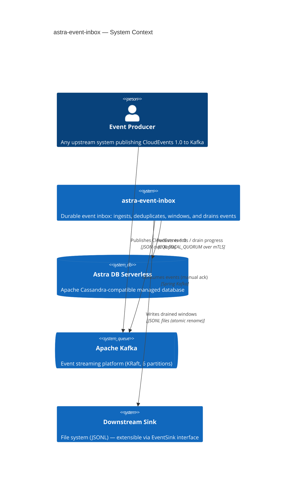

---

## 2. Component diagram

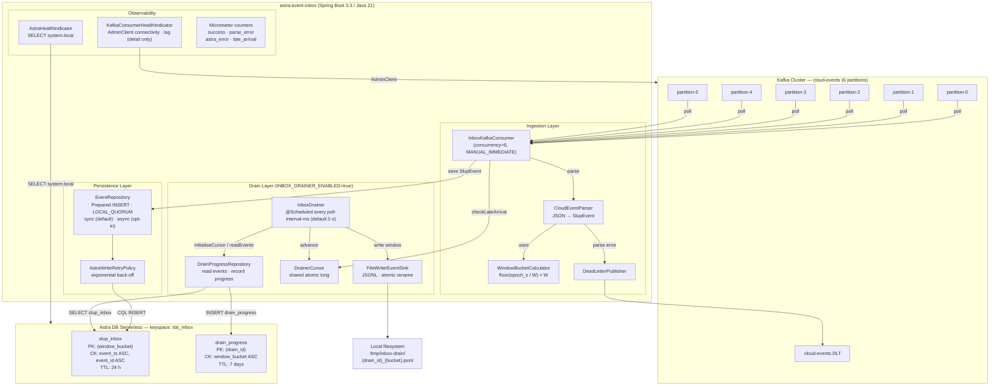

---

## 3. Ingestion data flow

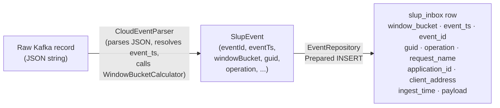

### Field mapping

| `slup_inbox` column | Source | Notes |
|---|---|---|
| `window_bucket` | `floor(epoch_s(event_ts) / W) * W` | Deterministic; depends only on `event_ts` |
| `event_ts` | `CloudEvent.data.timestamp` (preferred); falls back to `CloudEvent.time` when `data.timestamp` is null | Clustering key — defines row order within a bucket |
| `event_id` | `CloudEvent.id` | Clustering key — dedup key within `(window_bucket, event_ts)` |
| `guid` | `CloudEvent.data.guid` | Upstream entity identifier |
| `operation` | `CloudEvent.data.operation` | e.g. `SET`, `DELETE` |
| `request_name` | `CloudEvent.data.requestName` | |
| `application_id` | `CloudEvent.data.applicationId` | |
| `client_address` | `CloudEvent.data.clientAddress` | |
| `ingest_time` | `Instant.now()` in `CloudEventParser` at parse time | Wall-clock ingestion timestamp |
| `payload` | Full raw Kafka record JSON (the entire CloudEvent envelope) | Original envelope preserved verbatim. `data.slupTimestamp` is not mapped |

---

## 4. Kafka offset semantics

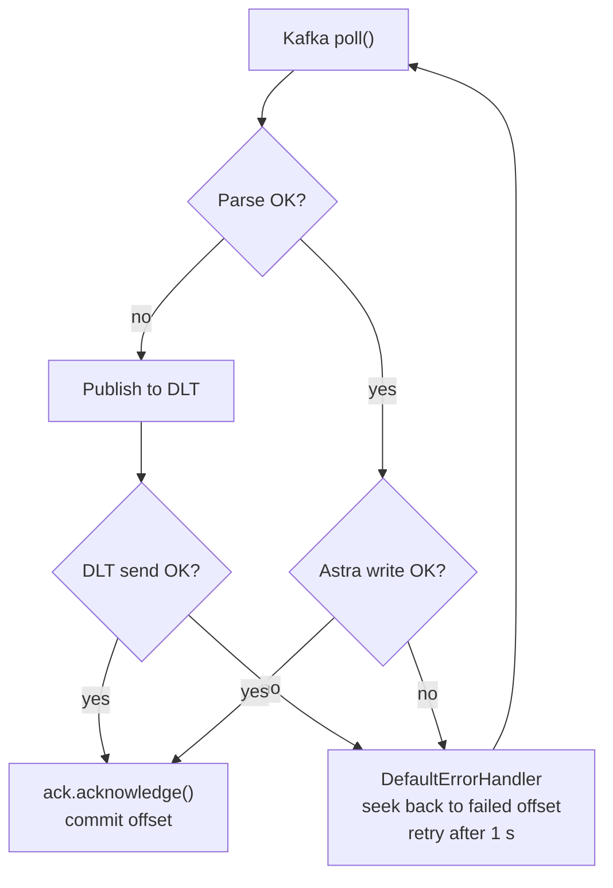

**Guarantee:** Offset N is committed when **either**:

1. The Astra write for record N succeeded (sync), or all in-flight async writes for that partition completed successfully, then ack; **or**
2. The record failed to parse **and** was successfully published to the DLT, then ack.

Otherwise the listener throws, `DefaultErrorHandler` seeks back to the failed offset (`FixedBackOff` with `UNLIMITED_ATTEMPTS`, interval `INBOX_KAFKA_RETRY_INTERVAL_MS`), and the offset is not committed. A later successful record in the same poll batch cannot advance past a failed offset.

---

## 5. Deduplication contract

The primary key:

```
PRIMARY KEY ((window_bucket), event_ts, event_id)
```

A CQL `INSERT` to a table with a composite primary key is an **idempotent upsert** at the Cassandra storage layer. Redelivering the same `event_id` at the same `event_ts` writes to the same cell — no duplicate row is created, and no read-before-write is needed.

**What breaks deduplication:**
- Upstream source reuses an `event_id` for a logically different event.
- Upstream source changes `event_ts` on redelivery (different primary key → two rows).

---

## 6. Time-window bucketing

```
window_bucket = floor(epoch_seconds(event_ts) / W) * W
```

- `W` = `INBOX_WINDOW_SIZE_SECONDS` (default **5 s**)
- Deterministic **assignment**: depends **only** on `event_ts`. Never on wall clock, drainer state, or sealed-bucket pointer.
- **Sealing** currently uses application wall clock: `now >= window_bucket + W + allowed_lateness_seconds` (`INBOX_ALLOWED_LATENESS_SECONDS`, default **60 s**). This is not a stream-derived event-time watermark (L-14, R-05).

Example with W=5, lateness=60:

| `event_ts` (epoch s) | `window_bucket` | Sealed after (epoch s) |
|---|---|---|
| 1_000_000_003 | 1_000_000_000 | 1_000_000_065 |
| 1_000_000_007 | 1_000_000_005 | 1_000_000_070 |
| 1_000_000_012 | 1_000_000_010 | 1_000_000_075 |

---

## 7. Drainer lifecycle

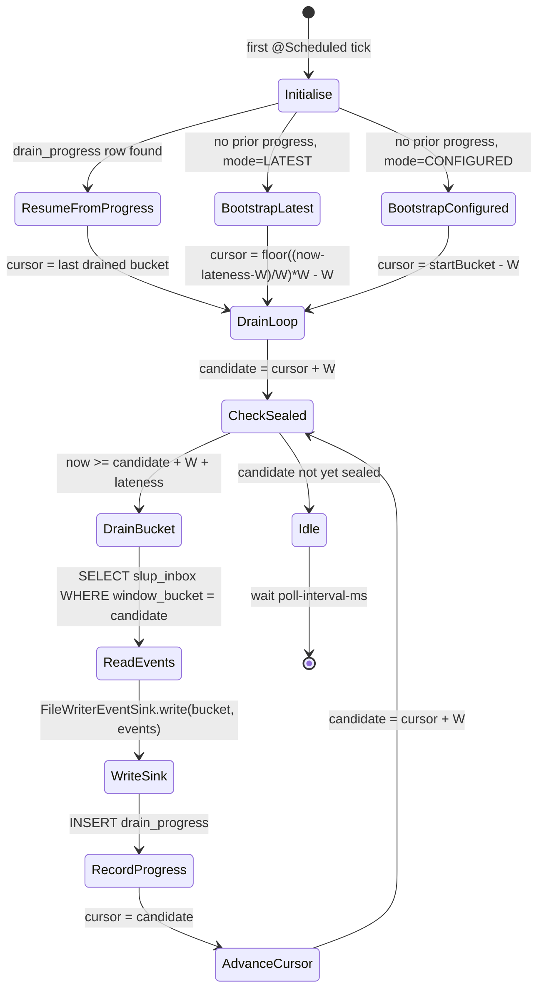

**Restart safety:** On restart, `initialiseCursorIfNeeded()` reads `drain_progress` and restores the cursor _before_ the first drain cycle. The shared `DrainerCursor` is updated immediately, so late-arrival detection is accurate from the very first event after restart.

**Bootstrap modes:**

| Mode | Cursor set to | First bucket drained |
|---|---|---|
| `LATEST` | `floor((now - lateness - W) / W) * W - W` | Earliest currently-sealed bucket. **Skips historical inbox rows** (including demo events with past `event_ts`) |
| `CONFIGURED` | `startBucket - W` | Exactly `startBucket`, then every later sealed 5 s window (including empty ones) until wall-clock catches up |

---

## 8. Database schema

### `tds_inbox.slup_inbox`

```sql
CREATE TABLE IF NOT EXISTS tds_inbox.slup_inbox (
    window_bucket   bigint,
    event_ts        timestamp,
    event_id        text,
    guid            text,
    operation       text,
    request_name    text,
    application_id  text,
    client_address  text,
    ingest_time     timestamp,
    payload         text,
    PRIMARY KEY ((window_bucket), event_ts, event_id)
)
WITH CLUSTERING ORDER BY (event_ts ASC, event_id ASC)
  AND default_time_to_live = 86400;
```

- One Cassandra partition per time window (5 s default).
- **Partition-size estimate only** (specification peak × assumed payload, not a measured result): at 2,000 msg/s peak, a 5 s window is ~10,000 events × ~4 KB ≈ **40 MB per partition**, under Astra’s 100 MB partition warning threshold. This calculation evaluates estimated partition size only. It does not validate end-to-end throughput, latency, hot-partition behaviour, or cost.
- TTL 24 h is a safety backstop. Adjust for your required inbox retention (see Open Design Question 9 in [`specification-compliance.md`](specification-compliance.md)).

### `tds_inbox.drain_progress`

```sql
CREATE TABLE IF NOT EXISTS tds_inbox.drain_progress (
    drain_id        text,
    window_bucket   bigint,
    drained_at      timestamp,
    event_count     bigint,
    PRIMARY KEY ((drain_id), window_bucket)
)
WITH CLUSTERING ORDER BY (window_bucket ASC)
  AND default_time_to_live = 604800;
```

- One row per drained window per drainer identity.
- 7-day TTL. If the drainer is idle for more than 7 days, the cursor is lost and it restarts from `LATEST`.

---

## 9. Async write path

Enabled by `INBOX_ASYNC_WRITES=true` (default: off). The listener still blocks until the current write completes before ack — this is not a pipelined multi-record write per partition.

```mermaid
sequenceDiagram
  participant Consumer as InboxKafkaConsumer
  participant Repo as EventRepository
  participant Semaphore as Semaphore(maxInFlight=4)
  participant Astra as Astra DB

  Consumer->>Repo: saveAsync(event)
  Repo->>Semaphore: acquire()  [process-wide; blocks if all permits taken]
  Semaphore-->>Repo: permit granted
  Repo->>Astra: session.executeAsync(bound)
  Repo-->>Consumer: CompletableFuture<Void>
  Consumer->>Consumer: add to partitionFutures[tp]
  Consumer->>Consumer: allOf(partitionFutures).get()  [wait before return]
  Astra-->>Repo: AsyncResultSet
  Repo->>Semaphore: release()
  Repo-->>Consumer: future.complete(null)
  Consumer->>Consumer: ack.acknowledge()
```

**What the code actually does:**

- `EventRepository.saveAsync` acquires the semaphore **inside the repository**, then calls `session.executeAsync`.
- `InboxKafkaConsumer.consumeAsync` waits on `CompletableFuture.allOf(partitionFutures).get()` **before** `ack.acknowledge()` and **before** returning from the listener.
- Because the listener waits for the current future, each consumer thread has at most **one** in-flight write at a time. The semaphore is **process-wide**, not per thread. With concurrency 6 and `maxInFlight=4`, at most **4** async CQL writes run concurrently (the other threads block on `acquire()`).
- The default of 4 is a cap, not "6 threads × 4 overlapping writes". Sync remains the default; async is opt-in and unvalidated by load test (L-05, L-10). The target workload is hundreds of msg/s typical and 1,000–2,000 msg/s peak at ~2–4 KB payload. The PoC has not been performance-validated against this target. No throughput guarantee is made.

---

## 10. Health and observability

### Endpoints

No `management.endpoint.health.group.*.include` is configured. Liveness and readiness are Spring **state probes only**. Astra and Kafka indicators participate in the **aggregate** `/actuator/health` only.

`management.endpoint.health.show-details` is `always`. HTTP clients therefore see each indicator's `details` map.

| Endpoint | Probe behaviour |
|---|---|
| `GET /actuator/health/liveness` | Spring `livenessState` — UP unless the process is in an unrecoverable state. Does **not** include Astra or Kafka |
| `GET /actuator/health/readiness` | Spring `readinessState` — UP once the application has started. Does **not** include Astra or Kafka |
| `GET /actuator/health` | Aggregate of all indicators (Astra, Kafka, disk, ping, liveness/readiness state). Compose healthcheck uses this URL |
| `GET /actuator/metrics` | Micrometer metric metadata and measurements as JSON — **not** a Prometheus scrape target. `/actuator/prometheus` requires adding the Prometheus registry |

### Micrometer counters

| Counter | Incremented when |
|---|---|
| `inbox.events.success` | Event successfully written to Astra and offset committed |
| `inbox.events.parse_error` | Parse failed (counter always; offset committed only if DLT send succeeds) |
| `inbox.events.astra_error` | Astra write failed; offset NOT committed |
| `inbox.events.late_arrival` | Event written to a bucket already past the drainer cursor |

### Health indicator details

**AstraHealthIndicator:** Executes `SELECT release_version FROM system.local` (not `slup_inbox`). Returns `UP` with `cluster`, `keyspace`, and `release_version` in the details map. Returns `DOWN` with error message. Never exposes credentials. A DOWN result rolls up into `/actuator/health`, not into `/actuator/health/readiness`. The Actuator component name is `astra`.

**KafkaConsumerHealthIndicator:** Calls `AdminClient.describeConsumerGroups` and `listConsumerGroupOffsets`. The Actuator component name is `kafkaConsumer`. Returns **DOWN** only when: AdminClient throws an exception, the group has no active members, or the group state is `DEAD`. Rebalancing states (`PREPARING_REBALANCE`, `COMPLETING_REBALANCE`) return **UP** with a `state` detail. Consumer lag is computed and exposed as `maxLagObserved` in the details map for observability, but **lag never causes DOWN**. `INBOX_KAFKA_HEALTH_MAX_LAG` (default 10,000) is retained as a reference label (`maxLagAllowed`) and does not affect the UP/DOWN result. Kafka DOWN rolls up into `/actuator/health` only.

---

## 11. Error handling matrix

| Scenario | Behaviour | Offset committed? |
|---|---|---|
| Successful write (sync) | `ack.acknowledge()` called | **Yes** |
| Successful write (async, all futures complete) | `ack.acknowledge()` called | **Yes** |
| Parse error, DLT send OK | Forward to DLT, `ack.acknowledge()` | **Yes** — poison message must not stall partition |
| Parse error, DLT send fails | Throw `IllegalStateException`, error handler seeks back | **No** — retried on next poll |
| Astra write failure (sync) | Rethrow, error handler seeks back, retry after `INBOX_KAFKA_RETRY_INTERVAL_MS` | **No** |
| Astra write failure (async) | Future completes exceptionally, throw, seek back, retry | **No** |
| Interrupted (async semaphore or allOf) | Re-interrupt thread, throw, seek back | **No** |

---

## 12. Dependencies

| Dependency | Version | Purpose |
|---|---|---|
| Spring Boot | 3.3.2 | Application framework |
| Spring Kafka | (Boot-managed) | Kafka consumer + producer |
| DataStax Java Driver | 4.17.0 | CQL client for Astra DB |
| Jackson | 2.17.1 | JSON parsing |
| Micrometer | (Boot-managed) | Metrics |
| Testcontainers | 1.19.8 | Declared in `pom.xml`; not used by current unit tests |
| Awaitility | (Boot-managed) | Declared in `pom.xml`; not used by current unit tests |

---

## 13. Event lifecycle

### Event journey

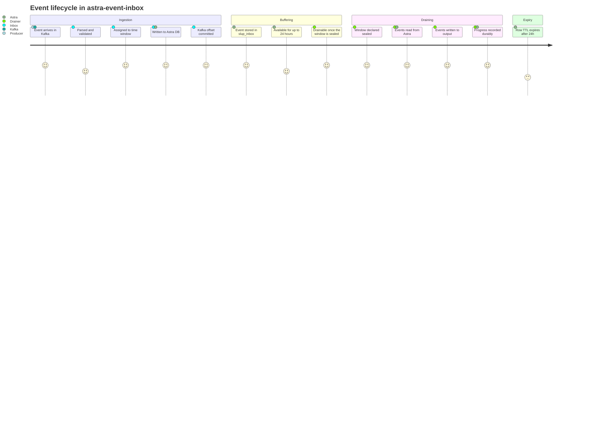

### Service capabilities

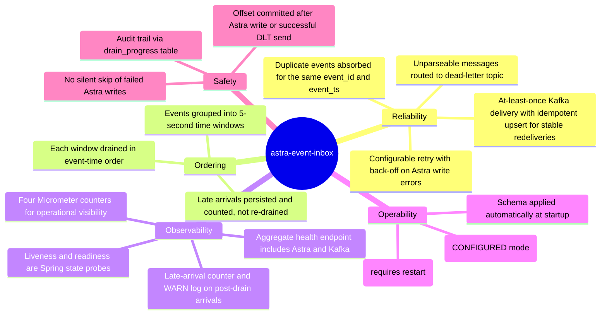

---

## 14. Failure scenarios

What the service does and what the data impact is for each failure:

| Failure scenario | What the service does | Data impact |
|---|---|---|
| **Kafka message cannot be parsed** | Published to `cloud-events.DLT`; offset committed only if the DLT send succeeds | Poison message isolated; if DLT send fails, offset is not committed and Kafka redelivers |
| **Astra DB temporarily unavailable** | Listener throws; `DefaultErrorHandler` seeks back and retries with 1 s back-off | No skip; Kafka retains the offset. Astra errors are **not** sent to the DLT |
| **Service crashes mid-write** | On restart, Kafka redelivers; same `(window_bucket, event_ts, event_id)` upserts the same row | At-least-once; no duplicate row for the same primary key |
| **Service restarts (drainer enabled, progress exists)** | Reads `drain_progress`; cursor = last recorded bucket; next drain is `cursor + W` | Last recorded window is not re-read. If progress was never written, that window is retried |
| **First start / no progress (`LATEST`)** | Cursor set to the earliest currently sealed wall-clock window | Older inbox rows are **not** drained |
| **Service restarts (drainer disabled)** | Resumes Kafka consumption from last committed offset; no drain | Ingestion continues; sealed windows stay in Astra until TTL |
| **Late-arriving event** | Written to its natural bucket; `inbox.events.late_arrival` incremented + WARN logged | Persisted, **not** re-drained; expires with row TTL unless replayed (L-07) |

---

## 15. Deployment model

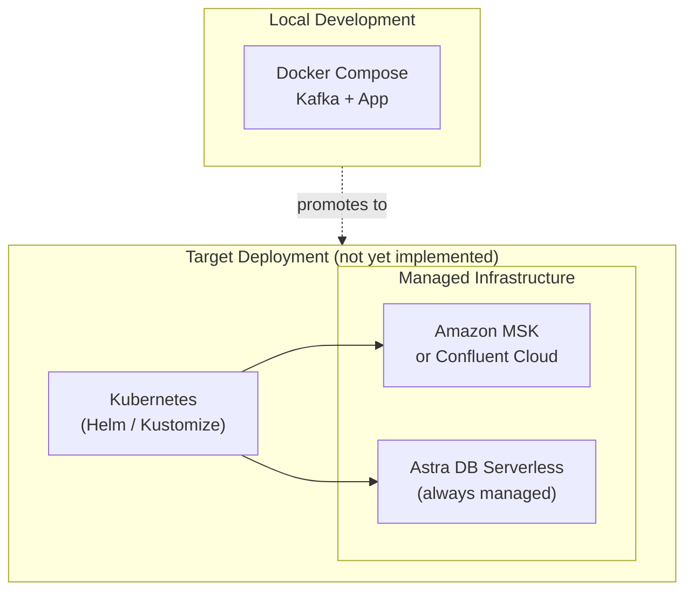

The service is **stateless** by design — all durable state lives in Astra DB. Horizontal scaling of the ingestion path is straightforward; the drainer requires a distributed lock before multiple replicas can run simultaneously.

---

## 16. Source code navigation

Read the source in this order to understand the data flow:

| File | What to understand |
|---|---|
| [`InboxProperties.java`](../src/main/java/com/tds/inbox/config/InboxProperties.java) | All configuration knobs in one place — start here for any config question |
| [`CloudEvent.java`](../src/main/java/com/tds/inbox/domain/CloudEvent.java) | Incoming message shape — CloudEvents 1.0 envelope with `data` sub-object |
| [`SlupEvent.java`](../src/main/java/com/tds/inbox/domain/SlupEvent.java) | Normalised internal record — what gets written to Astra |
| [`CloudEventParser.java`](../src/main/java/com/tds/inbox/service/CloudEventParser.java) | JSON → SlupEvent; resolves `event_ts` (prefers `data.timestamp`, falls back to `time`) |
| [`WindowBucketCalculator.java`](../src/main/java/com/tds/inbox/service/WindowBucketCalculator.java) | Single-responsibility bucketing formula |
| [`InboxKafkaConsumer.java`](../src/main/java/com/tds/inbox/kafka/InboxKafkaConsumer.java) | The main consumer loop — ack strategy, error handling, late-arrival detection |
| [`EventRepository.java`](../src/main/java/com/tds/inbox/repository/EventRepository.java) | CQL prepared statement, sync/async write paths, retry policy integration |
| [`InboxDrainer.java`](../src/main/java/com/tds/inbox/drainer/InboxDrainer.java) | Scheduled drain loop — sealed-bucket detection, cursor management, bootstrap modes |
| [`FileWriterEventSink.java`](../src/main/java/com/tds/inbox/drainer/FileWriterEventSink.java) | JSONL output with atomic `.tmp` → `.jsonl` rename — the `EventSink` extension point |
| [`DrainerCursor.java`](../src/main/java/com/tds/inbox/drainer/DrainerCursor.java) | Shared thread-safe `long` — updated by drainer, read by consumer for late-arrival detection |

**Key design decisions for contributors:**

- **Offset commitment order.** Parseable records are acknowledged after a successful Astra write. Unparseable records are acknowledged only after a successful DLT publication. A JVM crash between success and ack causes Kafka to redeliver; the idempotent upsert absorbs a stable-key redelivery (`event_id` + `event_ts` unchanged).

- **Deduplication boundary.** The primary key `(window_bucket, event_ts, event_id)` makes every INSERT an upsert for those three values. This is not unconditional deduplication by `event_id` alone. The same `event_id` with a different `event_ts` produces a second row. This is not end-to-end exactly-once processing.

- **Sync vs async writes.** Sync (`INBOX_ASYNC_WRITES=false`) is the default and the safe choice. Async is an opt-in performance mode with a process-wide semaphore cap (`INBOX_MAX_IN_FLIGHT_WRITES`). Do not enable async without load-test evidence that sync cannot meet throughput targets (see L-05).

- **DrainerCursor shared state.** `DrainerCursor` is a shared, thread-safe `long`. After a drain cycle completes, it advances. On restart, `initialiseCursorIfNeeded()` restores the cursor from `drain_progress` before the first consumer event is processed — late-arrival detection is accurate from the very first message after restart.

---

## 17. Sequence diagrams

All participants map directly to classes in `com.tds.inbox`.

### 17.1 Happy path — synchronous write (default)

`INBOX_ASYNC_WRITES=false` (default).

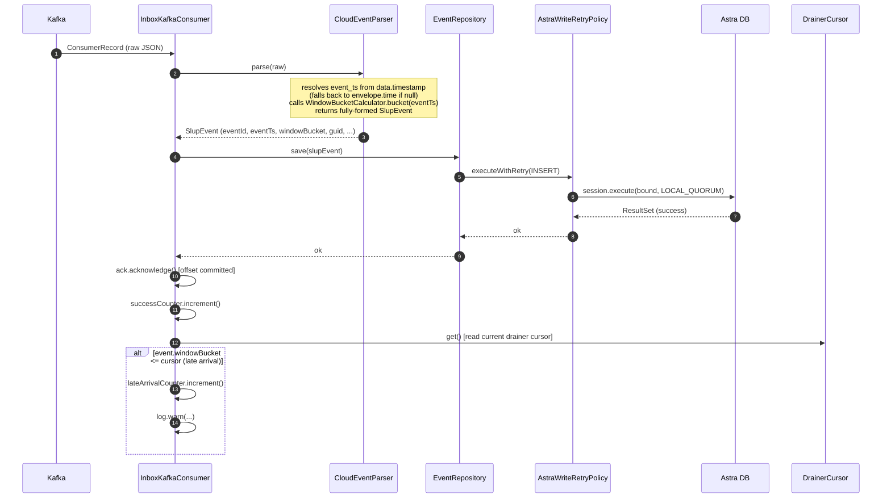

### 17.2 Parse error → dead-letter topic (DLT send succeeds)

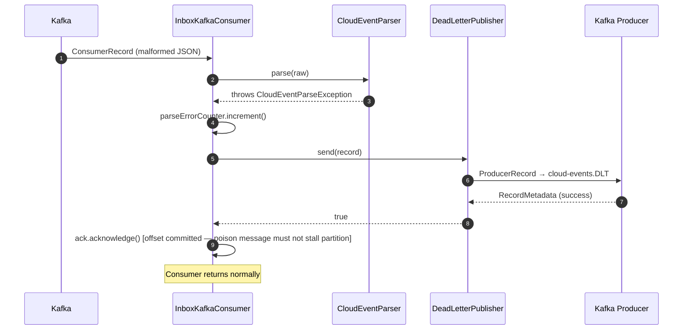

### 17.3 Parse error — DLT send failure

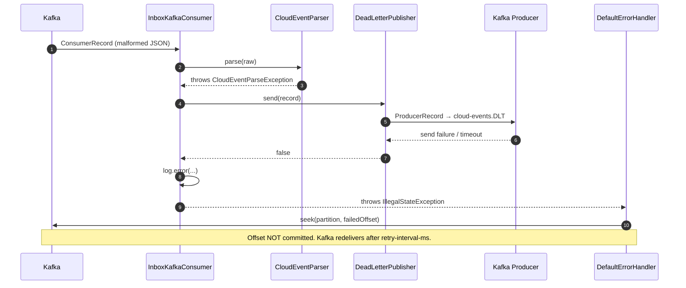

### 17.4 Astra write failure — synchronous path

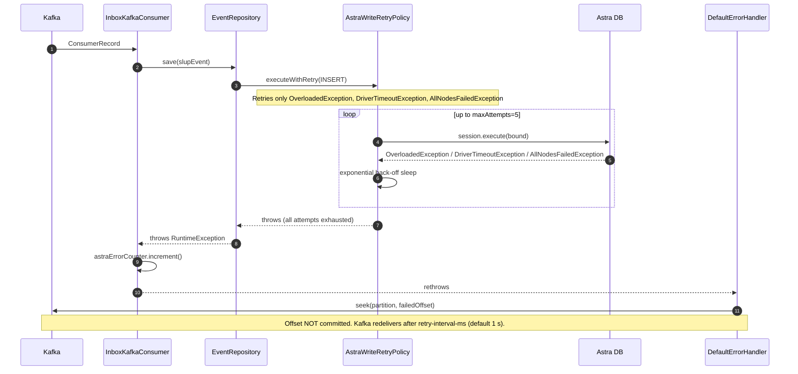

### 17.5 Asynchronous write path

Enabled by `INBOX_ASYNC_WRITES=true`. Semaphore is process-wide (not per thread). The listener waits on `allOf().get()` before ack — each consumer thread has at most one in-flight write.

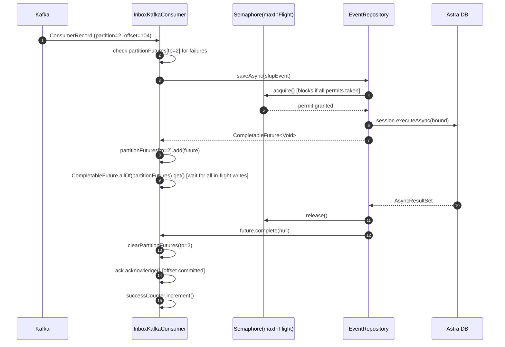

### 17.6 Drainer — normal drain cycle

Runs when `INBOX_DRAINER_ENABLED=true`.

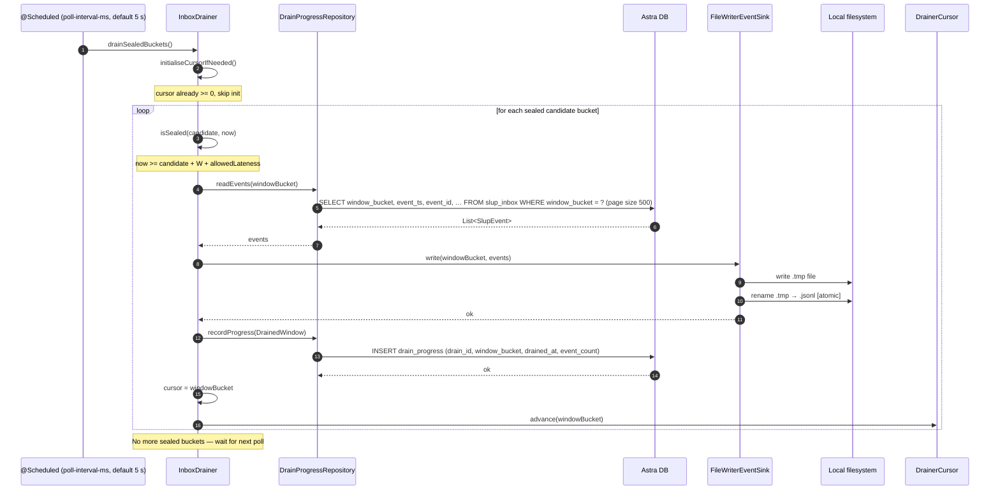

### 17.7 Drainer bootstrap — first run (LATEST mode)

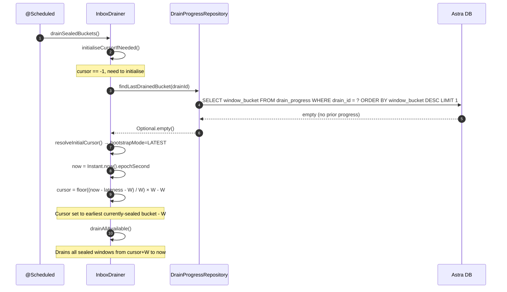

### 17.8 Restart — cursor restored from drain_progress

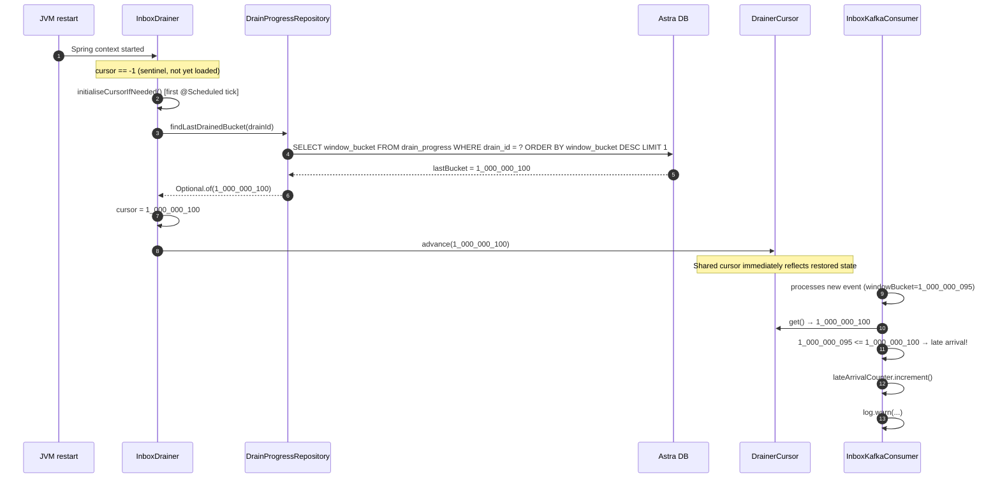

### 17.9 Application startup sequence

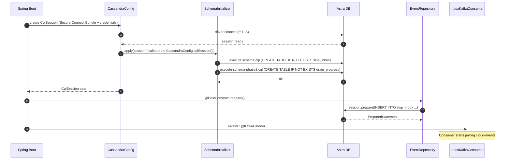
